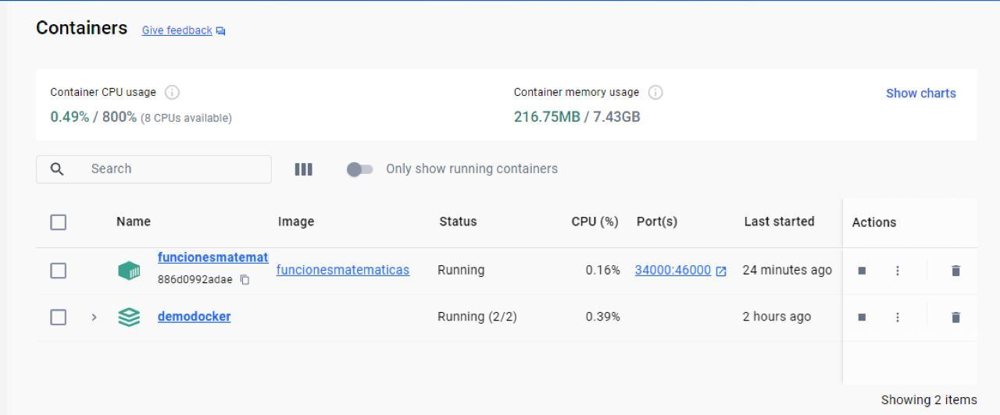
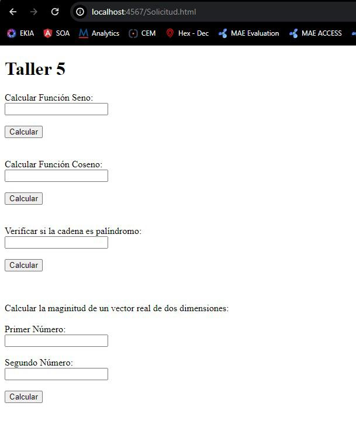
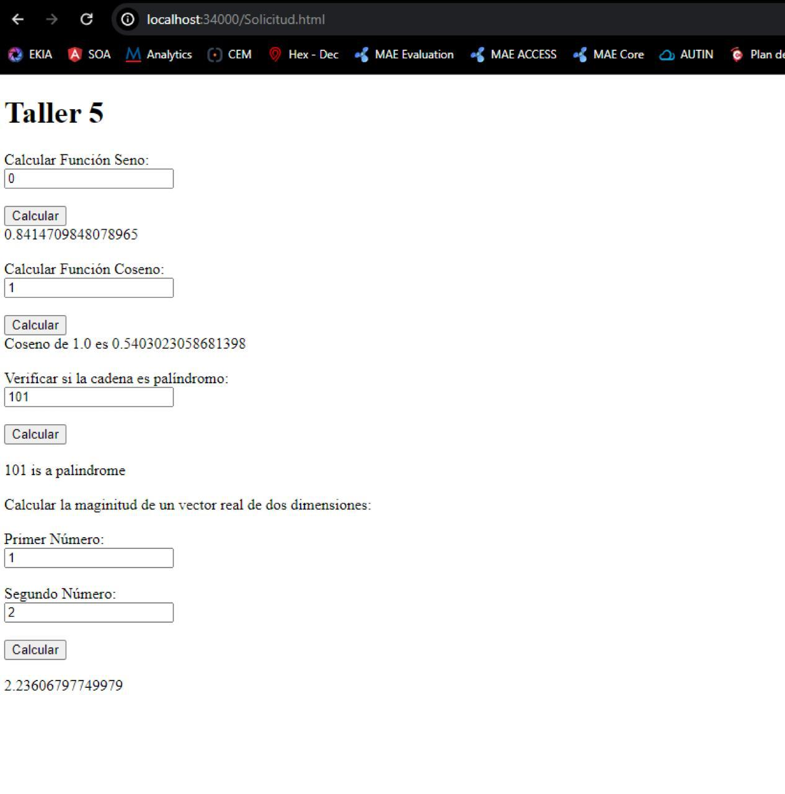

# Seminario de Virtualización y Docker: Introducción y Modularización

## Autor
**Yhonatan Steven Gomez Jimenez**

## Descripción
Este seminario aborda el desarrollo y la virtualización de una aplicación web utilizando Spark java. Se cubre la creación de un contenedor Docker para la aplicación, su despliegue local y la carga de la imagen del contenedor a DockerHub para su uso compartido.

## Requisitos Previos
- Java Versión: 8

## Instalación y Uso

### Paso 1: Descarga de la Imagen
Para comenzar, abra la terminal y descargue la imagen Docker necesaria con el siguiente comando:
```http
  docker pull yhonatangomez/taller5:latest
```
Luego de aplicar el comando aplicaremos el siguiente

```http
  docker run -d -p 34000:46000 --name funcionesmatematicas yhonatangomez/taller5
```

### Paso 3: Acceder a la Aplicación Web
Una vez que el contenedor esté funcionando, acceda a la aplicación web en la siguiente dirección:
```http
  http://localhost:34000/Solicitud.html
```


## Funcionalidades
- Cálculo del seno y coseno de un ángulo en radianes.
- Comprobación de palabras palíndromas.
- Cálculo de la magnitud de un vector bidimensional.

## Arquitectura y Diseño
La aplicación utiliza Spark java para manejar solicitudes HTTP. Se han implementado las funcionalidades especificadas, y la imagen de la aplicación se ha configurado y subido a DockerHub para su descarga y uso.

## Detalles Técnicos
- Gestión de Dependencias: Maven
- Versión del Proyecto: 1.0

---

